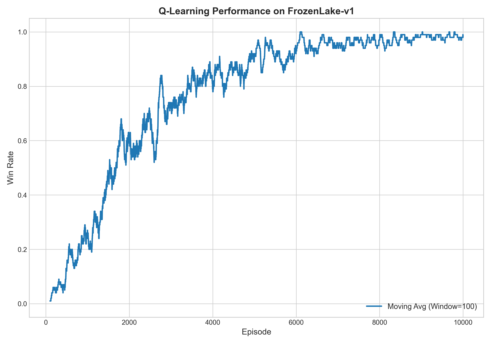
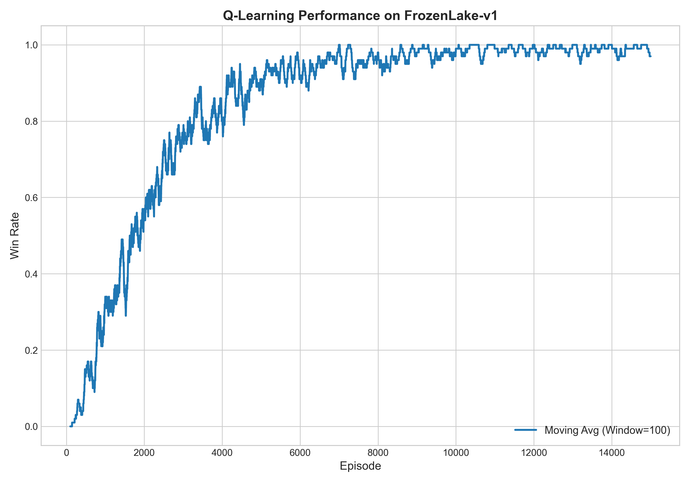

# FrozenLake — Tabular Q-Learning

Implementation of **Q-Learning** (off-policy TD control) on the Gymnasium `FrozenLake-v1` environment, built as part of a 30-day Reinforcement Learning study roadmap.

---

## Environment

FrozenLake is a 4×4 grid world. The agent starts at `S`, must reach the goal `G` while avoiding holes `H`, moving across frozen tiles `F`.

```
S F F F
F H F H
F F F H
H F F G
```

`is_slippery=False` — deterministic transitions, pure Q-learning with no stochasticity.

---

## Implementation

The agent maintains a **16×4 Q-table** (16 states × 4 actions) updated using the Bellman Optimality equation:

$$Q(s,a) \leftarrow Q(s,a) + \alpha \left[ r + \gamma \max_{a'} Q(s',a') - Q(s,a) \right]$$

**Epsilon decay** drives the shift from exploration to exploitation over training:

$$\varepsilon = \varepsilon_{min} + (\varepsilon_{max} - \varepsilon_{min}) \cdot e^{-\lambda \cdot t}$$

---

## Hyperparameter Tuning

Trained across 4 configurations comparing learning rate α and discount factor γ:

| Run | α | γ | Episodes | Final Win Rate |
|-----|-----|------|----------|---------------|
| 1 | 0.1 | 0.95 | 10,000 | ~95% |
| 2 | 0.9 | 0.99 | 10,000 | ~97% |
| 3 | 0.9 | 0.99 | 10,000 | ~97% |
| 4 | 0.9 | 0.99 | 15,000 | ~98% |

**Key finding:** Higher α (0.9) converges faster than lower α (0.1). Higher γ (0.99) values long-term rewards more, helping the agent plan a longer path to the goal. All configs eventually converge near 98%.

---

## Why This Approach Doesn't Scale

FrozenLake works with a Q-table because it has only **16 discrete states**. 
Environments like CartPole have a **continuous observation space** (cart position, 
cart velocity, pole angle, pole angular velocity) — infinite possible states mean
an infinite Q-table, which is impossible to store or compute.

This is exactly why **Deep Q-Networks (DQN)** exist — replacing the Q-table with a 
neural network that approximates Q(s,a) for any continuous state.

---

## Results

All runs show the same characteristic learning curve — steady climb from 0% to ~97% win rate, stabilizing after ~6,000 episodes.

| α=0.1, γ=0.95 | α=0.9, γ=0.99 |
|:---:|:---:|
|  |  |

| 10K Episodes | 15K Episodes |
|:---:|:---:|
|  |  |

---

## How to Run

```bash
pip install -r requirements.txt
python main.py
```

---

## References

- Sutton & Barto — *Reinforcement Learning: An Introduction* Ch. 6 — [free online](http://incompleteideas.net/book/the-book.html)
- [Gymnasium FrozenLake-v1 docs](https://gymnasium.farama.org/environments/toy_text/frozen_lake/)